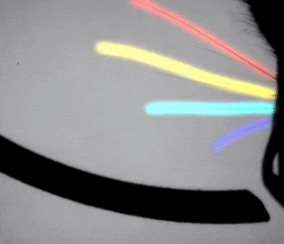

# whisker_segmentation

Here is a fully convolutional neural network that segments mouse whiskers for neuroscience behavioral experiments. This project was in collaboration with [Chris Rodgers](https://chris-rodgers.com/index.html), who collected the beautiful video above.
